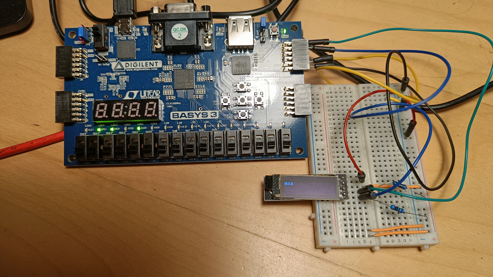

# Introduction
This project aims to implement I2C core, both master and slave.
Then, a scenario will be implemented to verify I2C is working on real FPGA
and not only in simulation. The master will be tested by showing three
numbers as a counter on SSD1306 with I2C interface.

I2C might be used for communication with multiple devices. It supports
up to 3.4 Mbps speeds (High-speed mode). [-@i2c]
That is sufficient for many applications. 
I2C is used often, most microcontrollers include
I2C hardware support as well.

There can be multiple devices on the bus
with just two wires, called ``sda`` and ``scl``. Every slave
gets an address assigned, and the master can select the device
by transmitting the address corresponding to selected slave.
There can be multiple masters on the bus. If both start
a transaction at the same time, there is an arbitration.
The first master that detects incorrect value of ``sda``
loses, and the other one gets to make the transaction.

# Manual
The project consists of multiple VHDL libraries.
The most important one is perhaps the i2c library located
in the ``src/i2c`` folder. This library uses the utils library located
in ``src/utils``. Blocks from the utils library are not documented here
for their simplicity. It contains a ``open_drain_buffer``, a ``metastability_filter``, a ``pulse_delay``
for delaying a pulse, ``sync_edge_detector`` for detecting rising or falling
edges on a signal synchronous to a clock.

There is ``ssd1306`` library with two entities for testing out the I2C master entity with
SSD1306 display. One of these makes the display full on, the other has a counter that
counts every second.

Last, but not least there is ``mcu_slave`` library that contains two
entities. One of these just respondes with a simple count when read I2C
requested. The other entity is behaving as a register reader/writer,
with 20 registers. The first written byte is treated as an address.
Other read bytes are consecutive reads from the registers. Other
writes are treated as consecutive writes to the registers.

## SSD1306 display counter
The SSD1306 display is a 128x64 display
that supports various interfacing methods such as I2C.

The characters used for the counter were obtained from a monochrome bitmap font [font8x8](https://github.com/dhepper/font8x8).

The display first has to be initialized, the RAM nulled, and then data might be sent then.
The display supports three addressing modes, page, horizontal, and vertical.
It has multiple pages, each page consists of 8 rows on the display.
The horizontal addressing mode is exploited for drawing characters/numbers.
The character can be written in one go, and after a character is written,
another one can be written correctly without adjusting the cursor.
This makes it possible to draw characters without storing them in some kind of buffer
on the master device.

See the following figure showing the setup with Basys 3 board with SSD1306 counter entity
connected to the SSD1306.

The top level entity consists of three main entities. One of those is for a BCD counter,
another for FSM for accessing the SSD1306 display, and the last for I2C master.

There are also three supporting entities, two open drain buffers
for ``scl`` and ``sda``. The last one is for treating metastability of the
reset.

## I2C
The implementation consists of two separate top level entities,
one of those is used for master entity and the other for slave entity.

The ``sda`` and ``scl`` lines are controlled by ``sda_enable`` and ``scl_enable`` signals.
Having these set to high means the line should be pulled down. There is also ``sda`` and
``scl`` inputs that should get the actual values of the GPIO.
An ``open_drain_buffer`` entity should be used
to connect the input and enable output to the actual pad.

Both master and slave entities share the rx and tx data interfaces.
The difference is that master has signals for requesting a new transaction,
but the slave waits for a start condition to start receiving/transmitting.

### Entity ``master``
The master entity is a top level entity for using the I2C
core as a master. It connects all of the blocks for functioning
I2C master.

The entity has three control inputs ``start``, ``stop``, and ``run``.
Run should be high when the master is operating. Setting start high
will generate a start condition when possible. Setting stop high
will generate a stop condition when possible.
Both start and stop should be set high for just one cycle.
When setting both start and stop high at the same time,
one byte will be transmitted or received, and then stop condition
generated.

{width=400px}

| **Name**            | **Type**            | **Description** |
|---------------------|---------------------|-----------------|
| clk_i               | std_logic           |                 |
| rst_in              | std_logic           |                 |
| slave_address_i     | std_logic_vector[7] |                 |
| generate_ack_i      | std_logic           |                 |
| expect_ack_i        | std_logic           |                 |
| rx_valid_o          | std_logic           |                 |
| rx_data_o           | std_logic_vector[8] |                 |
| rx_confirm_i        | std_logic           |                 |
| tx_ready_o          | std_logic           |                 |
| tx_valid_i          | std_logic           |                 |
| tx_data_i           | std_logic_vector[8] |                 |
| tx_clear_buffer_i   | std_logic           |                 |
| err_noack_data_o    | std_logic           |                 |
| err_noack_address_o | std_logic           |                 |
| err_arbitration_o   | std_logic           |                 |
| err_general_o       | std_logic           |                 |
| stop_i              | std_logic           |                 |
| start_i             | std_logic           |                 |
| run_i               | std_logic           |                 |
| rw_i                | std_logic           |                 |
| dev_busy_o          | std_logic           |                 |
| bus_busy_o          | std_logic           |                 |
| waiting_o           | std_logic           |                 |
| sda_i               | std_logic           |                 |
| scl_i               | std_logic           |                 |
| sda_enable_o        | std_logic           |                 |
| scl_enable_o        | std_logic           |                 |

### Entity ``slave``
Slave entity is a top level for I2C slave.

It outputs the current state upon receiving _commands_ from the master.

{width=400px}

| **Name**          | **Type**            | **Description** |
|-------------------|---------------------|-----------------|
| clk_i             | std_logic           |                 |
| rst_in            | std_logic           |                 |
| address_i         | std_logic_vector[7] |                 |
| generate_ack_i    | std_logic           |                 |
| expect_ack_i      | std_logic           |                 |
| rx_valid_o        | std_logic           |                 |
| rx_data_o         | std_logic_vector[8] |                 |
| rx_confirm_i      | std_logic           |                 |
| rx_stretch_i      | std_logic           |                 |
| tx_ready_o        | std_logic           |                 |
| tx_valid_i        | std_logic           |                 |
| tx_data_i         | std_logic_vector[8] |                 |
| tx_stretch_i      | std_logic           |                 |
| tx_clear_buffer_i | std_logic           |                 |
| err_noack_o       | std_logic           |                 |
| err_sda_o         | std_logic           |                 |
| rw_o              | std_logic           |                 |
| dev_busy_o        | std_logic           |                 |
| bus_busy_o        | std_logic           |                 |
| waiting_o         | std_logic           |                 |
| sda_i             | std_logic           |                 |
| scl_i             | std_logic           |                 |
| sda_enable_o      | std_logic           |                 |
| scl_enable_o      | std_logic           |                 |

\newpage
### Common
All of the blocks responsible for receiving or sending data
should get the``scl`` state from the input going to the FPGA/ASIC,
the same goes for ``sda``.
This makes sure that features such as scl stretching or arbitration
are supported. If scl from ``scl_generator`` were to be used, there
would be no possibility to detect either one of those.

Some of the entities accept delayed falling pulse of ``scl``.
This is to make sure ``sda`` is changed AFTER ``scl`` is indeed
low. If ``sda`` was changed right away, it's possible there would
be a device that would detect start or stop condition when
there is no condition.

#### Entity ``address_generator``
Address generator is responsible for sending
address upon requested. It's used in the I2C master
to select a slave. Currently it supports only 7 bit addresses.

{width=400px}

| **Name**              | **Type**            | **Description** |
|-----------------------|---------------------|-----------------|
| clk_i                 | std_logic           | Clock input                |
| rst_in                | std_logic           | Synchronous reset (active low)                |
| address_i             | std_logic_vector[7] | The address to send                |
| rw_i                  | std_logic           | R/W to send (R = 1)                |
| store_address_rw_i    | std_logic           | When to store address and ``rw``                |
| start_i               | std_logic           | Start sending address                |
| scl_rising_i          | std_logic           | ``scl`` rising pulse                |
| scl_falling_delayed_i | std_logic           | ``scl`` falling pulse delayed                |
| sda_enable_o          | std_logic           | Keep ``sda`` low                |
| sda_i                 | std_logic           | Current ``sda`` level                |
| noack_o               | std_logic           | Did not get acknowledge                |
| unexpected_sda_o      | std_logic           | ``sda`` detected at ``scl`` rising edge is wrong. (Arbitration lost)                |
| done_o                | std_logic           | Address sent                |

#### Entity ``address_detector``
Address detector looks at the received data to check
if the address matches the address of the slave.
Currently it supports only 7 bit addresses.

{width=400px}

| **Name**              | **Type**            | **Description** |
|-----------------------|---------------------|-----------------|
| clk_i                 | std_logic           | Clock input                |
| rst_in                | std_logic           | Synchronous reset (active low)                |
| address_i             | std_logic_vector[7] | The address to detect                |
| store_address_i       | std_logic           | When to store the address to buffer                |
| scl_rising            | std_logic           | ``scl`` rising pulse                |
| scl_falling_delayed_i | std_logic           | ``scl`` falling pulse delayed                |
| sda_enable_o          | std_logic           | Keep ``sda`` low                |
| sda_i                 | std_logic           | Current ``sda`` level                |
| start_i               | std_logic           | Start detecting address with next ``scl``                |
| rw_o                  | std_logic           | Detected R/W value                |
| success_o             | std_logic           | Address matching. ``rw`` set                |
| fail_o                | std_logic           | Address not matching                |

\newpage
#### Entity ``rx``
Receiver entity is responsible for receiving data from the
data bit line (``sda``), and delivering the bytes received.
It's not meant to be used as detector of the address, that is
what ``address_detector`` is for.

The entity supports ``scl`` stretching. When the data are not yet
read (that should be signaled by ``confirm_read_i``), it will stretch
the ``scl`` to prevent loss of data.
For master, this means ``scl`` is not generated, for slave it
means it's held down even though the master is trying to let go
to get high level.

The entity is also responsible for acknowledging the received data.
All data are acknowledged.

{width=400px}

| **Name**              | **Type**            | **Description** |
|-----------------------|---------------------|-----------------|
| clk_i                 | std_logic           | Clock input                |
| rst_in                | std_logic           | Synchronous reset (active low)                |
| start_read_i          | std_logic           | Read should be initiated on next scl                |
| rst_i2c_i             | std_logic           | Reset only i2c logic, keep data                |
| scl_rising            | std_logic           | ``scl`` rising pulse                |
| scl_falling_delayed_i | std_logic           | ``scl`` falling pulse, delayed                |
| scl_stretch_o         | std_logic           | Keep ``scl`` low                |
| sda_i                 | std_logic           | Current ``sda`` level                |
| sda_enable_o          | std_logic           | Whether to keep ``sda`` low                |
| done_o                | std_logic           | Byte received, acknowledged                |
| generate_ack_i        | std_logic           | Generate acknowledge after received                |
| read_valid_o          | std_logic           | ``read_data`` are valid for reading                |
| read_ready_o          | std_logic           | Ready for next transaction                |
| read_data_o           | std_logic_vector[8] | Read data                |
| confirm_read_i        | std_logic           | Confirm data were read                |

\newpage
#### Entity ``tx``
Receiver entity is responsible for transmitting data to the
data bit line (``sda``), and for storing the data to be sent next.
It's not meant to be used as generator/sender of the address, that is
what ``address_generator`` is for.

The entity supports ``scl`` stretching. When there are not any
data to be sent delivered yet, it will stretch
the ``scl`` to prevent loss of data.
For master, this means ``scl`` is not generated, for slave it
means it's held down even though the master is trying to let go
to get high level.

If wrong level is detected on the ``sda`` upon rising edge of ``scl``,
the entity signals 

The entity is also responsible for verifying acknowledge at the right time,
and signaling that no acknowledge has been received.

{width=400px}

| **Name**              | **Type**            | **Description** |
|-----------------------|---------------------|-----------------|
| clk_i                 | std_logic           | Clock input                |
| rst_in                | std_logic           | Synchronous reset (active low)                |
| start_write_i         | std_logic           | Write should be initiated                 |
| rst_i2c_i             | std_logic           | Reset only i2c logic, keep data                |
| clear_buffer_i        | std_logic           | Clear transmit buffer                |
| done_o                | std_logic           | Data transmitted, and acknowledged                |
| unexpected_sda_o      | std_logic           | ``sda`` value was wrong on ``scl`` rising                |
| noack_o               | std_logic           | Did not get ACK                |
| scl_rising            | std_logic           | ``scl`` rising pulse                |
| scl_falling_delayed_i | std_logic           | ``scl`` falling pulse, delayed                |
| scl_stretch_o         | std_logic           | Keep ``scl`` low                |
| sda_i                 | std_logic           | Current ``sda`` level                |
| sda_enable_o          | std_logic           | Keep ``sda`` low                |
| ready_o               | std_logic           | Ready for new data                |
| valid_i               | std_logic           | Data in ``write_data`` are valid                |
| write_data_i          | std_logic_vector[8] | Data to transmit                |

\newpage
#### Entity ``scl_generator``
Scl generator generates the ``scl`` while making sure
to keep the signal high or low for at least specified number of cycles.
It may send a signal when the ``scl`` cannot be set to high level,
that could signal a slave pulling down the line.

{width=400px}

| **Name**         | **Type**  | **Description** |
|------------------|-----------|-----------------|
| clk_i                 | std_logic           | Clock input                |
| rst_in                | std_logic           | Synchronous reset (active low)                |
| scl_i            | std_logic | Current level of ``scl``                |
| scl_rising_i     | std_logic | ``scl`` rising pulse                |
| scl_falling_i    | std_logic | ``scl`` falling pulse               |
| gen_continuous_i | std_logic | Generate continuous ``scl`` clock                |
| gen_rising_i     | std_logic | Generate rising edge                |
| gen_falling_i    | std_logic | Generate falling edge                |
| scl_enable_o     | std_logic | Keep ``scl`` low                |
| cannot_comply_o  | std_logic | Cannot set ``scl`` high                |

| **Name**          | **Type** | **Description** |
|-------------------|----------|-------------------|
| MIN_STABLE_CYCLES | natural  | How many clock cycles to keep ``scl`` on stable                 |

#### Entity ``startstop_condition_detector``
This entity detects either start or stop condition.
It produces a pulse for duration of one clock cycle
when either start or stop is detected.

{width=300px}

| **Name** | **Type**  | **Description** |
|----------|-----------|-----------------|
| clk_i                 | std_logic           | Clock input                |
| sda_i                 | std_logic           | Current ``sda`` level                |
| scl_i            | std_logic | Current level of ``scl``                |
| start_o  | std_logic | Start condition detected                |
| stop_o   | std_logic | Stop condition detected                |

\newpage
#### Entity ``startstop_condition_generator``
Generates either start or stop condition. If the
scl has to be changed to different level, it generates
a request that should be handled by the ``scl_generator``.
The generator should be able to generate the condition
from any starting state, as long as nothing else, including
the slaves, is not holding down either ``scl`` or ``sda``.
If the ``sda`` has to be changed to be able to generate the condition,
``scl`` is first requested to be pulled down, ``sda`` is changed,
after that, ``scl`` is requested to be high, and as last, the
``sda`` is changed to generate the condition. Some of those might
be omitted according to the actual state of the ``sda`` and ``scl``.

{width=400px}

| **Name**              | **Type**  | **Description** |
|-----------------------|-----------|-----------------|
| clk_i                 | std_logic           | Clock input                |
| rst_in                | std_logic           | Synchronous reset (active low)                |
| sda_i                 | std_logic | Current level of ``sda``                |
| scl_rising_i     | std_logic | ``scl`` rising pulse                |
| scl_falling_i    | std_logic | ``scl`` falling pulse               |
| scl_falling_delayed_i | std_logic | ``scl`` delayed falling pulse                |
| sda_enable_o          | std_logic | Keep ``sda`` low                |
| start_condition_i     | std_logic | Start condition detected                |
| stop_condition_i      | std_logic | Stop condition detected                |
| gen_start_i           | std_logic | Generate start condition                |
| gen_stop_i            | std_logic | Generate stop condition                |
| req_scl_fall_o        | std_logic | Request scl falling edge                |
| req_scl_rise_o        | std_logic | Request scl rising edge                |
| early_condition_o     | std_logic | Detected early condition (prior to generating ourselves)                |
| done_o                | std_logic | Requested condition generated                |

| **Name** | **Type** | **Description** |
|----------|----------|-------------------|
| DELAY    | natural         | How long to wait after each operation                  |

#### Entity ``master_state`` 
This entity is a FSM for the ``master`` entity.
It commands what should be done, such as generating
the address, receiving data, transmitting data, etc.
It also detects errors and in case of one, outputs it.
The errors are cleared upon next start request so that
it might be validated if there has been a new error for the
start request.

Inputs and outputs from other entities, should be explained by other entities well already.

{width=400px}

#### Entity ``slave_state`` 
This entity is a FSM for the ``slave`` entity.
It commands what should be done, such as detecting
the address, receiving data, transmitting data, etc.
It also detects errors and in case of one, outputs it.
The errors are cleared upon next start condition.

Inputs and outputs from other entities, should be explained by other entities well already.

{width=400px}

# Conclusion
Both master and slave have been verified to be working in simulation and on an FPGA board.
All found issues were found, and when the issues were found on the FPGA, but not in simulation,
a new testcase has been added to make sure the behavior is verified if there were any changes made.

The components correctly monitor the bus even when they are not being used,
and output if the bus is busy or not. There are errors reported
in case something went wrong (cannot set ``sda``, arbitration lost, etc.).
This should make the I2C components usable in real applications even if more masters
are incorporated on the bus.

There are some things that could be added or changed in the future, such as:
- 10 bit addressing support
- More error states (timeout)
- Disabling data acknowledge
- Adding behavioral i2c master and i2c slave modules for simulation

The 10 bit addressing is not currently supported, although its support should not be hard
to implement. ``address_generator`` and ``address_detector`` entities interfaces make
it so that it would be sufficient to pospone setting ``done`` after the second byte
is received instead of the first one.

So far if the scl generator entity detects an error (that it cannot get the line high),
it will produce a signal to say that, but this signal is not utilized in the FSM entity
for the master. That means if the line stays low indefinitely, the master will become stuck
without notifying the application about a possible problem. One of the slave devices could
be erroneously holding down the line.

Currently it's not possible to disable the data acknowledge in the rx entity.
Some applications don't produce acknowledge if data are not ready yet or
if wrong command has been received. Although I don't think this complies with the standard,
it could come in handy to support this as well.

The simulation currently uses blocking procedures for testing.
These procedures are called from the top level simulation entities.
This makes it hard to test some of the features such as verifying whether
error signal became high at the correct``scl`` edge.
It's also quite hard to test having multiple devices on the bus sending data simultaneously.
That could come in handy to test arbitration.
Both of these could be overcome by adding i2c behavioral modules, and instead of generating
the ``scl`` and ``sda`` from the top level testing entity, they would be generated
by these behavioral models.
The top level entity would just notify the behavioral models to start generating or expect the
given transaction.

# References
